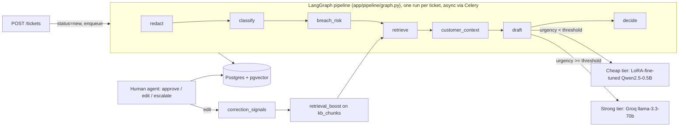

# ResolveIQ

An AI-assisted support-ticket triage tool for a fintech company. A ticket
comes in, gets classified and PII-redacted, relevant knowledge-base content
is retrieved, a grounded draft reply is generated with cited sources and a
confidence score, and a human agent approves, edits, or escalates it. Edits
feed back into retrieval ranking, so a correction on one ticket measurably
improves the draft on the next similar one — that feedback loop is the
project's core mechanic (see [04_App_Flow.md](04_App_Flow.md)).

Full spec docs: [01_PRD.md](01_PRD.md) · [02_TRD.md](02_TRD.md) ·
[03_UI_UX_Design.md](03_UI_UX_Design.md) · [04_App_Flow.md](04_App_Flow.md) ·
[05_Backend_Schema.md](05_Backend_Schema.md) ·
[06_Implementation_Plan.md](06_Implementation_Plan.md)

## Architecture



Four pipeline "agents" in the TRD's sense (distinct, inspectable steps — not
autonomous free-acting agents): a trained classifier (category + urgency,
not an LLM guess), a pgvector retrieval agent (category-filtered,
correction-boosted), a drafting agent (cost-routed between a locally
fine-tuned small model and a stronger hosted one), and a decision agent
(confidence + urgency + category → review routing, never auto-send).

## Features

1. **Drafting + feedback loop** (core, built deep) — classify → retrieve →
   draft → decide, human review, corrections re-rank retrieval.
2. **Customer history context** — a summary of a customer's prior tickets is
   injected into the (strong-tier) drafting prompt.
3. **SLA breach-risk prioritization** — a small classifier trained on a
   synthetic age/category/urgency/queue-depth rule reorders the queue.
4. **Agent coaching insights** — edit-distance, resolution time, and
   escalation rate aggregated per agent; pure reporting, no new backend logic.

## Production LLM techniques

| Technique | Where it lives |
|---|---|
| Structured output | `app/ml/classifier.py` — trained classifier, not an LLM guess |
| Grounding + citations | `app/drafting/draft.py` — every draft cites the chunks it used |
| Prompt versioning | `app/drafting/prompts.py` — prompts as versioned functions, not inline strings |
| Model routing | `app/drafting/draft.py` — LoRA-fine-tuned small model for routine tickets, Groq-hosted model for harder/urgent ones |
| Retry + timeout + fallback | `app/drafting/draft.py` (`tenacity` retry + "needs manual response" fallback on exhaustion) |
| Guardrails (PII redaction) | `app/redaction/pii.py` — runs before any LLM call or log write |
| Observability/tracing | `app/core/tracing.py` — Langfuse `@observe` on every pipeline node + LLM/embedding call |
| Automated evaluation | `app/eval/ragas_eval.py` — RAGAS non-LLM context precision/recall on an 18-example held-out set |
| Feedback loop | `app/retrieval/retrieve.py` (`adjust_retrieval_boost`) — the project's one differentiating mechanic |

## Tech stack

FastAPI (async) · PostgreSQL + pgvector · LangGraph · Celery + Redis ·
Next.js · JWT auth (access + rotated refresh) · Langfuse · RAGAS · Docker
Compose. Rationale for each choice is in
[02_TRD.md](02_TRD.md#1-tech-stack-and-why).

## Quick start

`postgres`, `redis`, and `frontend` are containerized and verified working:

```bash
cp .env.example .env   # fill in GROQ_API_KEY at minimum
docker compose up -d postgres redis
docker compose up --build frontend
```

The `api`/`worker` services have Dockerfiles and are wired into
`docker-compose.yml`, but **run them locally instead** (see below) rather
than via `docker compose up --build api worker`: the image bundles
torch + CUDA + Unsloth, which is a multi-GB download (10-20GB) — building
it filled this project's dev machine's disk during development. If you have
the room and want it containerized, `docker compose build api` builds just
that image so you can gauge the size before committing to `up`.

**GPU note**: the cheap-tier drafting model (a LoRA-fine-tuned Qwen2.5-0.5B)
needs a GPU visible to the `api`/`worker` containers via the [NVIDIA
Container Toolkit](https://docs.nvidia.com/datacenter/cloud-native/container-toolkit/latest/install-guide.html)
if you do containerize them. No GPU passthrough available? Set
`CHEAP_TIER_URGENCY_THRESHOLD=0` in `.env` — every ticket then routes to the
Groq-hosted strong tier instead, and you can drop the `deploy.resources` GPU
block in `docker-compose.yml` entirely.

## Manual/dev setup (recommended for api/worker)

```bash
# Postgres + Redis
docker compose up -d postgres redis

# Backend
cd backend
uv sync
uv run alembic upgrade head
uv run python -m app.scripts.seed_admin you@example.com yourpassword
uv run uvicorn app.main:app --reload          # terminal 1
uv run celery -A app.worker worker --loglevel=info --pool=solo   # terminal 2 (Windows needs --pool=solo)

# Frontend — either containerized (above) or:
cd frontend
npm install
npm run dev
```

## Seeding & training

Run once against a fresh database, from `backend/`:

```bash
uv run python -m app.kb.embed                  # chunk + embed the KB articles
uv run python -m app.ml.train_classifier        # category/urgency classifier
uv run python -m app.ml.train_breach_risk       # SLA breach-risk classifier
uv run python -m app.ml.finetune.train          # LoRA fine-tune the cheap-tier model (needs GPU)
uv run python -m app.scripts.seed_demo          # pre-seeded demo tickets — see DEMO.md
```

## Eval & observability

```bash
uv run python -m app.eval.ragas_eval
```

Runs retrieval over an 18-example hand-labeled set spanning all 5 ticket
categories and reports RAGAS non-LLM context precision/recall (string
similarity against the correct KB document, no LLM judge — deterministic
and doesn't burn API quota). Latest run: **mean precision 0.79, mean recall
0.69**.

Langfuse tracing is opt-in: set `LANGFUSE_PUBLIC_KEY`/`LANGFUSE_SECRET_KEY`
in `.env` and every pipeline node plus each LLM/embedding call appears as a
trace at your configured `LANGFUSE_HOST`. Unset, it's a no-op — no code
changes needed either way.

## Demo

See [DEMO.md](DEMO.md) for the rehearsed walkthrough: pre-seeded tickets at
different urgency/breach-risk levels, one live-typed ticket, and the
correction-improves-next-draft sequence.

## Project structure

```
backend/app/
  api/routes/       FastAPI routers (auth, tickets, admin, health)
  core/              config, security, rate limiting, tracing
  db/                SQLAlchemy session/engine
  decision/          decision/escalation agent
  drafting/          drafting agent (cheap + strong tier, prompts, customer context)
  eval/              RAGAS retrieval-quality eval
  kb/                knowledge-base embedding
  ml/                trained classifiers (category/urgency, breach-risk) + LoRA fine-tune
  models/            SQLAlchemy models
  pipeline/          LangGraph state machine wiring the agents together
  redaction/         PII redaction
  retrieval/         pgvector retrieval agent + feedback-loop boost adjustment
  schemas/           Pydantic request/response models
  scripts/           admin seeding, demo seeding
  tasks.py, worker.py  Celery task + app
frontend/src/app/    Next.js pages (login, queue, ticket detail, admin views)
alembic/             DB migrations
```
